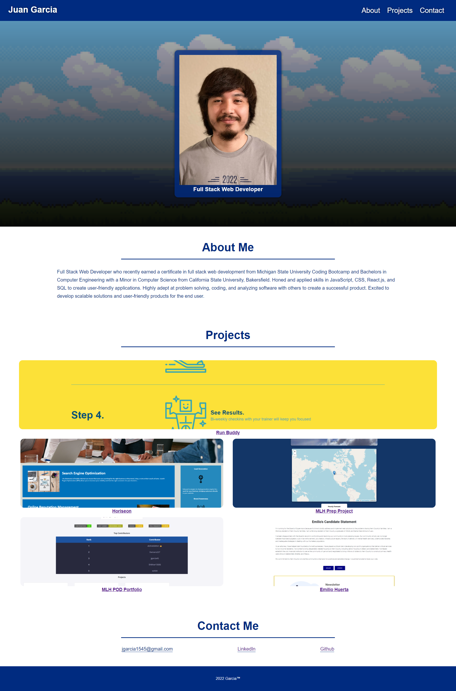

# Professional Portfolio
[](https://bootcamp.msu.edu/)

## Technologies


## Description
Our challenge is to create a professional portfolio to showcase our skills and talents to employers. We will be applying the core skills we recently learned: flexbox, media queries, and css variables. We will continue to add more core skills as we progress throughout the course.

## Acceptance Criteria
```
GIVEN I need to sample a potential employee's previous work
WHEN I load their portfolio
THEN I am presented with the developer's name, a recent photo or avatar, and links to sections about them, their work, and how to contact them
WHEN I click one of the links in the navigation
THEN the UI scrolls to the corresponding section
WHEN I click on the link to the section about their work
THEN the UI scrolls to a section with titled images of the developer's applications
WHEN I am presented with the developer's first application
THEN that application's image should be larger in size than the others
WHEN I click on the images of the applications
THEN I am taken to that deployed application
WHEN I resize the page or view the site on various screens and devices
THEN I am presented with a responsive layout that adapts to my viewport
```

## Screenshot
Here is a preview of the website provide: 

## Link
A link to the [Code](https://github.com/jgarcia45/professional-portfolio):
```
https://github.com/jgarcia45/professional-portfolio
```

A link to the deployed [URL](https://jgarcia45.github.io/professional-portfolio/):
```
https://jgarcia45.github.io/professional-portfolio/
```
